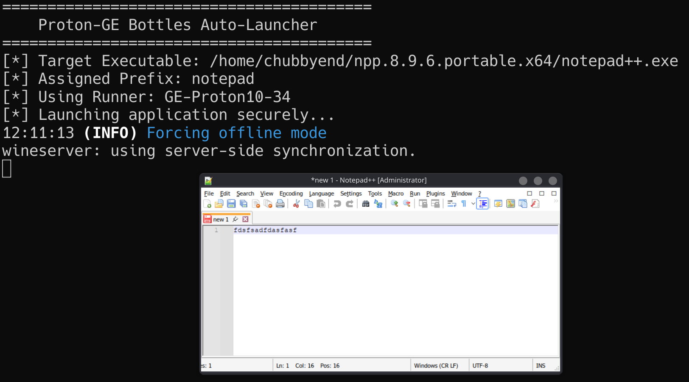
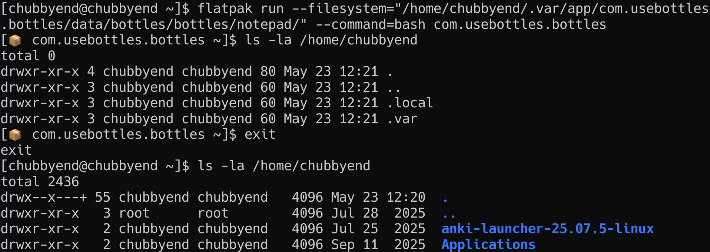

# Proton-GE Isolated Launcher  
**Portfolio Project - Security Research & Automation**

This repository is part of my cybersecurity portfolio. It demonstrates sandboxing, isolation, and secure execution environments on Linux using Proton-GE and Bottles via Flatpak. It is not intended for general distribution, production use, or as a supported tool.

---

## Purpose

This project explores how to run untrusted Windows executables on Linux inside an isolated environment using:

- Proton-GE  
- Bottles (Flatpak)  
- Flatpak sandboxing  
- Per-application Wine prefixes  

The primary objective is to reduce the host attack surface by ensuring each executable is jailed within its own discrete Wine prefix with restricted filesystem access, while also offering convenience as applications can be run by a simple right-click via the GUI if the .desktop file is configured and prefixes are automatically generated with sensible naming based on the executable filename, as implemented by this script. Proton-GE was utilised as it offers high compatibility when running Windows software on Linux, especially for niche applications in some cases over vanilla Wine.

This approach is relevant when handling untrusted binaries or installers from unknown sources. It can increase security when running potentially trojanised software downloaded from unofficial sources.

---

## Security Context

Threat actors occasionally distribute trojanized versions of legitimate Windows software, such as modified versions of Notepad++. Executing such binaries inside a sandboxed Proton-GE environment significantly mitigates the risk of host compromise. This project demonstrates an automated method for isolating such executables.

---

## Requirements

Before utilising the script, the following prerequisites are as follows:

1. **Flatpak Bottles is installed:**
   ```bash
   flatpak install flathub com.usebottles.bottles
   ```

2. **Proton-GE is installed into Bottles Flatpak via ProtonUp-Qt:**  
   This ensures the runner exists within the Bottles Flatpak data directory. The script dynamically locates the latest version, of GE-Proton.

3. **Bottles initialization:**  
   You must manually create at least one bottle via the graphical interface first, allowing Bottles to initialise its internal directory structure.

4. **Target accessibility:**  
   The executable intended for execution must reside in a location accessible to the Bottles Flatpak.

---

## Technical Implementation & Prefix Directory

The provided `proton-ge-isolated-launcher.sh` script automates the creation of isolated execution environments. It stores isolated Wine prefixes inside the default Bottles Flatpak directory:

```bash
$HOME/.var/app/com.usebottles.bottles/data/bottles/bottles
```

This specific location is utilised because it is natively accessible to the Bottles Flatpak sandbox, meaning no manual Flatpak permission changes should be required.

The automation script executes the following logic:

- Detects the appropriate Proton-GE runner dynamically.  
- Extracts the executable filename to generate a sanitised, filesystem-safe and easily comprehendible prefix name.  
- Creates a new prefix using the long-flags of bottles-cli (`--bottle-name`, `--environment application`, `--runner`) only if the prefix does not already exist, preventing unintended overwrites.  
- Launches the executable securely inside the Flatpak sandbox.

**Note regarding customisations:**  
The current script hardcodes the prefix directory to ensure compatibility with Bottle's Flatpak permissions. If overriding the prefix path is required, the script must be manually modified, and the new directory explicitly permitted.

---

## Screenshots & Portfolio Evidence

### **Figure 1: Verified Execution**

This screenshot demonstrates the successful execution of notepad++.exe utilizing the GE-Proton10-34 runner. The script successfully parses the file path, assigns the prefix name *notepad*, and launches the application securely through the bottles-cli.



---

### **Figure 2: Flatpak Sandbox Isolation Validation**

This screenshot serves as technical validation of the filesystem namespaces applied by the Flatpak container.

**Inside the Sandbox (Top):**  
A bash shell is instantiated inside the Flatpak container pointing to the isolated prefix directory. Executing `ls -la` on the host user's home directory (`/home/chubbyend`) returns a total size of 0, revealing only the skeletal `.local` and `.var` directories automatically generated by Flatpak.

**Outside the Sandbox (Bottom):**  
Executing the identical `ls -la` command directly on the host machine returns a total size of 2436, displaying the full, unprotected directory contents, including applications and personal data.

This directly proves that a compromised binary executing within the sandbox possesses zero visibility into the host's actual home directory.



---

## Desktop Integration

For operational convenience, a template desktop entry file is provided:

```
proton-ge-isolated-launcher.desktop
```

This file requires manual adjustment of the `Exec=` path (`/path/to/proton-ge-isolated-launcher.sh %f`) and is included to demonstrate how context-menu integration (e.g. “Right-Click to Sandbox”) can be established within a Linux desktop environment to offer convenience running Window's executable files.

---

## AI-Assistance Transparency

AI tools were utilised to assist in the development of the accompanying bash script. All logic was reviewed and validated manually.

---

## Support & License

This project is not supported or maintained, existing solely as an artifact for my cybersecurity portfolio.

**License:** MIT License
